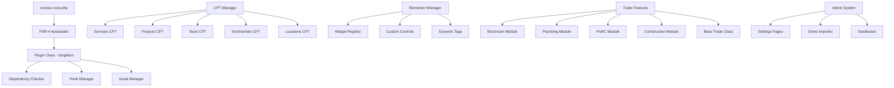

# Design Document

## Overview

The Revolux Core Plugin implements a comprehensive companion plugin architecture for the Revolux WordPress theme, providing custom post types, Elementor widgets, and trade-specific functionality. The design follows a modular approach with PHP 8.0+ strict typing, singleton pattern implementation, and clean separation of concerns between presentation (theme) and functionality (plugin). The architecture prioritizes performance, extensibility, and seamless integration with Elementor while maintaining independence from the theme for content preservation.

## Architecture

### High-Level Architecture



### Plugin Architecture Philosophy

The plugin implements a **modular architecture** with clear separation of concerns:

1. **Plugin Class (Singleton)**: Main orchestrator handling initialization, dependencies, and core setup
2. **CPT Manager**: Handles all custom post type and taxonomy registration
3. **Elementor Manager**: Manages widget registration, categories, and Elementor integration
4. **Trade Features**: Modular trade-specific functionality with inheritance-based architecture
5. **Admin System**: Comprehensive admin interface and settings management
6. **API Integration**: External service connections and webhook management

### Namespace Structure

```php
namespace RevoluxCore;                           // Base namespace
namespace RevoluxCore\Classes;                   // Core plugin classes
namespace RevoluxCore\Elementor;                 // Elementor integration
namespace RevoluxCore\Elementor\Widgets;         // Widget classes
namespace RevoluxCore\PostTypes;                 // CPT handlers
namespace RevoluxCore\TradeFeatures;             // Trade-specific modules
namespace RevoluxCore\Admin;                     // Admin functionality
namespace RevoluxCore\Integrations;              // Third-party integrations
```

## Components and Interfaces

### 1. Plugin Foundation Component

**Location**: `inc/classes/Plugin.php`

**Responsibilities**:

- Plugin initialization and dependency management
- Hook registration and asset loading
- License management and updates
- Error handling and logging

**Singleton Implementation**:

```php
final class Plugin {
    private static ?Plugin $instance = null;
    private string $version = '0.1.0';
    private bool $dependencies_met = false;

    public static function instance(): Plugin {
        if (null === self::$instance) {
            self::$instance = new self();
        }
        return self::$instance;
    }

    private function __construct() {
        $this->define_constants();
        $this->check_dependencies();
        $this->init_hooks();
    }
}
```

**Key Methods**:

```php
public function init(): void                     // Main initialization
public function check_dependencies(): bool       // Dependency validation
public function load_textdomain(): void         // Internationalization
protected function define_constants(): void     // Plugin constants
protected function init_hooks(): void           // Hook registration
```

### 2. Custom Post Type Management Component

**Location**: `inc/classes/PostTypes.php`

**Responsibilities**:

- Registration of all custom post types
- Custom taxonomy management
- Meta box integration
- Template hierarchy support

**CPT Structure**:

```php
class PostTypes {
    private array $post_types = [
        'revolux_service'     => 'Services',
        'revolux_project'     => 'Projects',
        'revolux_team'        => 'Team Members',
        'revolux_testimonial' => 'Testimonials',
        'revolux_location'    => 'Locations'
    ];

    public function register_post_types(): void;
    public function register_taxonomies(): void;
    public function setup_meta_boxes(): void;
    public function flush_rewrite_rules(): void;
}
```

**Services CPT Configuration**:

```php
private function get_service_args(): array {
    return [
        'labels'             => $this->get_service_labels(),
        'public'             => true,
        'publicly_queryable' => true,
        'show_ui'            => true,
        'show_in_menu'       => true,
        'query_var'          => true,
        'rewrite'            => ['slug' => 'services'],
        'capability_type'    => 'post',
        'has_archive'        => true,
        'hierarchical'       => false,
        'menu_position'      => 25,
        'menu_icon'          => 'dashicons-hammer',
        'supports'           => ['title', 'editor', 'thumbnail', 'excerpt', 'custom-fields'],
        'show_in_rest'       => true,
    ];
}
```

### 3. Elementor Integration Component

**Location**: `inc/elementor/Manager.php`

**Responsibilities**:

- Widget category registration
- Widget class loading and registration
- Custom control registration
- Asset enqueueing for widgets

**Widget Management System**:

```php
class Manager {
    private array $widgets = [];
    private array $categories = [];

    public function init(): void;
    public function register_categories(): void;
    public function register_widgets(): void;
    public function enqueue_widget_assets(): void;
    protected function get_widget_list(): array;
}
```

**Widget Registration Pattern**:

```php
public function register_widgets(): void {
    if (!did_action('elementor/loaded')) {
        return;
    }

    $widgets = [
        'Service_Grid',
        'Project_Gallery',
        'Team_Carousel',
        'Testimonial_Slider',
        'Business_Hours',
        'Quote_Form',
        'Emergency_Banner'
    ];

    foreach ($widgets as $widget) {
        $class_name = "RevoluxCore\\Elementor\\Widgets\\{$widget}";
        if (class_exists($class_name)) {
            \Elementor\Plugin::instance()->widgets_manager->register(new $class_name());
        }
    }
}
```

### 4. Widget Base Architecture

**Location**: `inc/elementor/widgets/Base_Widget.php`

**Base Widget Structure**:

```php
abstract class Base_Widget extends \Elementor\Widget_Base {

    public function get_categories(): array {
        return ['revolux-elements'];
    }

    public function get_keywords(): array {
        return ['revolux', 'trade', 'business'];
    }

    protected function register_style_controls(): void {
        // Common styling controls
    }

    protected function register_content_controls(): void {
        // Common content controls
    }

    protected function render_widget_header(): void {
        // Common widget header
    }

    protected function render_widget_footer(): void {
        // Common widget footer
    }
}
```

### 5. Trade Features Architecture

**Location**: `inc/trade-features/TradeBase.php`

**Base Trade Class**:

```php
abstract class TradeBase {
    protected string $trade_name;
    protected array $features = [];
    protected array $widgets = [];

    abstract public function get_trade_name(): string;
    abstract public function get_features(): array;
    abstract public function register_widgets(): void;

    public function init(): void;
    public function add_customizer_options(): void;
    public function enqueue_trade_assets(): void;
    protected function register_trade_cpt(): void;
}
```

**Electrician Implementation**:

```php
class Electrician extends TradeBase {
    protected string $trade_name = 'electrician';

    public function get_features(): array {
        return [
            'safety_tips',
            'electrical_calculator',
            'permit_tracker',
            'energy_efficiency',
            'emergency_guide'
        ];
    }

    public function register_widgets(): void {
        // Electrician-specific widgets
    }

    public function add_safety_tips_widget(): void;
    public function add_electrical_calculator(): void;
    public function add_permit_tracker(): void;
}
```

### 6. Admin Interface Component

**Location**: `inc/admin/Dashboard.php`

**Admin Dashboard Structure**:

```php
class Dashboard {
    private array $menu_pages = [];
    private array $settings_sections = [];

    public function init(): void;
    public function add_admin_menu(): void;
    public function register_settings(): void;
    public function render_dashboard_page(): void;
    public function render_settings_page(): void;
    public function handle_ajax_requests(): void;
}
```

**Settings Management**:

```php
class Settings {
    private string $option_group = 'revolux_core_settings';
    private array $default_options = [];

    public function register_settings(): void;
    public function get_option(string $key, mixed $default = null): mixed;
    public function update_option(string $key, mixed $value): bool;
    public function get_all_options(): array;
    public function reset_options(): bool;
}
```

## Data Models

### Custom Post Type Meta Structure

**Services Meta Fields**:

```php
interface ServiceMetaInterface {
    public function get_service_price(): ?float;
    public function get_service_duration(): ?int;
    public function get_service_features(): array;
    public function is_emergency_service(): bool;
    public function get_service_gallery(): array;
}

class ServiceMeta implements ServiceMetaInterface {
    private int $post_id;
    private array $meta_keys = [
        'price_range' => '_revolux_service_price_range',
        'duration' => '_revolux_service_duration',
        'features' => '_revolux_service_features',
        'emergency' => '_revolux_service_emergency',
        'gallery' => '_revolux_service_gallery'
    ];
}
```

**Projects Meta Fields**:

```php
interface ProjectMetaInterface {
    public function get_project_cost(): ?float;
    public function get_completion_date(): ?string;
    public function get_before_after_gallery(): array;
    public function get_materials_used(): array;
    public function get_team_members(): array;
}
```

### Widget Configuration Model

**Widget Settings Structure**:

```php
class WidgetConfig {
    private array $default_settings = [];
    private array $style_options = [];
    private array $content_options = [];

    public function get_content_controls(): array;
    public function get_style_controls(): array;
    public function get_responsive_controls(): array;
    public function validate_settings(array $settings): array;
}
```

### Integration API Model

**Third-Party Integration Structure**:

```php
interface IntegrationInterface {
    public function authenticate(): bool;
    public function send_data(array $data): array;
    public function get_data(array $params): array;
    public function handle_webhook(array $payload): bool;
}

class CRMIntegration implements IntegrationInterface {
    private string $api_key;
    private string $api_url;
    private array $endpoints = [];

    public function send_lead(array $lead_data): bool;
    public function create_appointment(array $appointment_data): bool;
    public function sync_customer_data(): array;
}
```

## Error Handling

### Error Handling Strategy

1. **Dependency Management**: Graceful degradation when dependencies are missing
2. **Widget Failures**: Fallback rendering for widget errors
3. **API Failures**: Retry mechanisms and fallback options
4. **Data Validation**: Comprehensive input validation and sanitization

### Dependency Checking

```php
public function check_dependencies(): bool {
    $errors = [];

    // Check WordPress version
    if (version_compare(get_bloginfo('version'), '6.0', '<')) {
        $errors[] = __('WordPress 6.0+ is required.', 'revolux-core');
    }

    // Check PHP version
    if (version_compare(PHP_VERSION, '8.0', '<')) {
        $errors[] = __('PHP 8.0+ is required.', 'revolux-core');
    }

    // Check Elementor
    if (!did_action('elementor/loaded')) {
        $errors[] = __('Elementor plugin is required.', 'revolux-core');
    }

    // Check theme
    $theme = wp_get_theme();
    if ($theme->get('TextDomain') !== 'revolux') {
        add_action('admin_notices', [$this, 'theme_compatibility_notice']);
    }

    if (!empty($errors)) {
        add_action('admin_notices', function() use ($errors) {
            foreach ($errors as $error) {
                echo '<div class="notice notice-error"><p>' . esc_html($error) . '</p></div>';
            }
        });
        return false;
    }

    return true;
}
```

### Widget Error Handling

```php
protected function render(): void {
    try {
        $settings = $this->get_settings_for_display();
        $this->validate_settings($settings);
        $this->render_widget_content($settings);
    } catch (Exception $e) {
        if (defined('WP_DEBUG') && WP_DEBUG) {
            echo '<div class="revolux-widget-error">';
            echo '<p>' . __('Widget Error:', 'revolux-core') . ' ' . esc_html($e->getMessage()) . '</p>';
            echo '</div>';
        }
        $this->render_fallback_content();
    }
}

private function render_fallback_content(): void {
    echo '<div class="revolux-widget-fallback">';
    echo '<p>' . __('Content temporarily unavailable.', 'revolux-core') . '</p>';
    echo '</div>';
}
```

### API Integration Error Handling

```php
public function send_api_request(string $endpoint, array $data): array {
    $response = wp_remote_post($this->api_url . $endpoint, [
        'body' => json_encode($data),
        'headers' => [
            'Content-Type' => 'application/json',
            'Authorization' => 'Bearer ' . $this->api_key
        ],
        'timeout' => 30
    ]);

    if (is_wp_error($response)) {
        error_log('Revolux Core API Error: ' . $response->get_error_message());
        return ['success' => false, 'error' => 'Connection failed'];
    }

    $status_code = wp_remote_retrieve_response_code($response);
    if ($status_code !== 200) {
        error_log("Revolux Core API Error: HTTP {$status_code}");
        return ['success' => false, 'error' => 'API request failed'];
    }

    $body = wp_remote_retrieve_body($response);
    $decoded = json_decode($body, true);

    if (json_last_error() !== JSON_ERROR_NONE) {
        error_log('Revolux Core API Error: Invalid JSON response');
        return ['success' => false, 'error' => 'Invalid response format'];
    }

    return ['success' => true, 'data' => $decoded];
}
```

## Testing Strategy

### Unit Testing Architecture

**Test Structure**:

```
tests/
├── unit/
│   ├── PluginTest.php
│   ├── PostTypesTest.php
│   ├── ElementorManagerTest.php
│   └── widgets/
│       ├── ServiceGridTest.php
│       └── ProjectGalleryTest.php
├── integration/
│   ├── ElementorIntegrationTest.php
│   ├── ThemeIntegrationTest.php
│   └── APIIntegrationTest.php
├── fixtures/
│   ├── sample-services.json
│   ├── sample-projects.json
│   └── widget-settings.json
└── bootstrap.php
```

**Plugin Class Tests**:

```php
class PluginTest extends WP_UnitTestCase {
    private Plugin $plugin;

    public function setUp(): void {
        parent::setUp();
        $this->plugin = Plugin::instance();
    }

    public function test_singleton_implementation(): void {
        $instance1 = Plugin::instance();
        $instance2 = Plugin::instance();

        $this->assertSame($instance1, $instance2);
    }

    public function test_dependency_checking(): void {
        // Mock Elementor not loaded
        remove_action('elementor/loaded');

        $result = $this->plugin->check_dependencies();
        $this->assertFalse($result);
    }

    public function test_post_type_registration(): void {
        $this->plugin->init();

        $this->assertTrue(post_type_exists('revolux_service'));
        $this->assertTrue(post_type_exists('revolux_project'));
        $this->assertTrue(post_type_exists('revolux_team'));
    }
}
```

**Widget Testing**:

```php
class ServiceGridTest extends WP_UnitTestCase {
    private Service_Grid $widget;

    public function setUp(): void {
        parent::setUp();
        $this->widget = new Service_Grid();
    }

    public function test_widget_registration(): void {
        $this->assertEquals('revolux-service-grid', $this->widget->get_name());
        $this->assertContains('revolux-elements', $this->widget->get_categories());
    }

    public function test_widget_rendering(): void {
        // Create test services
        $service_id = $this->factory->post->create([
            'post_type' => 'revolux_service',
            'post_title' => 'Test Service'
        ]);

        $settings = [
            'layout' => 'grid',
            'columns' => 3,
            'show_excerpt' => 'yes'
        ];

        ob_start();
        $this->widget->render_widget_content($settings);
        $output = ob_get_clean();

        $this->assertStringContains('Test Service', $output);
        $this->assertStringContains('revolux-service-grid', $output);
    }
}
```

### Integration Testing

**Elementor Integration Tests**:

```php
class ElementorIntegrationTest extends WP_UnitTestCase {
    public function test_widget_category_registration(): void {
        // Simulate Elementor loaded
        do_action('elementor/loaded');

        $categories = \Elementor\Plugin::instance()->elements_manager->get_categories();
        $this->assertArrayHasKey('revolux-elements', $categories);
    }

    public function test_widget_registration_with_elementor(): void {
        do_action('elementor/loaded');
        do_action('elementor/widgets/register');

        $widgets = \Elementor\Plugin::instance()->widgets_manager->get_widget_types();
        $this->assertArrayHasKey('revolux-service-grid', $widgets);
    }
}
```

### Performance Testing

**Database Query Optimization**:

```php
class PerformanceTest extends WP_UnitTestCase {
    public function test_service_query_performance(): void {
        // Create 100 test services
        for ($i = 0; $i < 100; $i++) {
            $this->factory->post->create([
                'post_type' => 'revolux_service'
            ]);
        }

        $start_time = microtime(true);
        $start_queries = get_num_queries();

        $services = get_posts([
            'post_type' => 'revolux_service',
            'posts_per_page' => 12
        ]);

        $end_time = microtime(true);
        $end_queries = get_num_queries();

        $execution_time = $end_time - $start_time;
        $query_count = $end_queries - $start_queries;

        $this->assertLessThan(0.1, $execution_time); // Less than 100ms
        $this->assertLessThan(5, $query_count); // Less than 5 queries
    }
}
```

### Browser Testing Matrix

**Widget Compatibility Testing**:

- Chrome (latest 2 versions) - Elementor editor and frontend
- Firefox (latest 2 versions) - Widget rendering and interactions
- Safari (latest 2 versions) - Mobile widget responsiveness
- Edge (latest 2 versions) - Admin interface compatibility

**Responsive Testing**:

- Mobile: 320px - 767px (Widget stacking and mobile interactions)
- Tablet: 768px - 1023px (Grid layouts and touch interactions)
- Desktop: 1024px+ (Full widget functionality)
- Large Desktop: 1440px+ (Wide layout optimization)

This design provides a comprehensive foundation for the Revolux Core plugin that maintains clean separation from the theme while providing powerful functionality for trade businesses through Elementor integration and custom post types.
