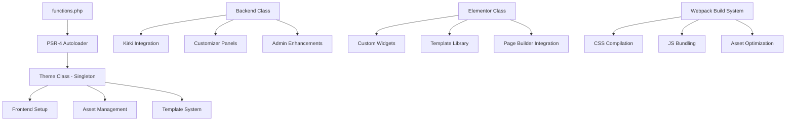

# Design Document

## Overview

The Revolux Core Theme implements a modern, performance-optimized WordPress theme architecture specifically designed for trade professionals. The design follows a consolidated three-class pattern with PHP 8.0+ strict typing, Webpack-based asset management, and comprehensive Kirki framework integration for customization. The architecture prioritizes maintainability, extensibility, and ThemeForest marketplace standards while providing a solid foundation for trade-specific websites.

## Architecture

### High-Level Architecture



### Class Architecture Philosophy

The theme implements a **consolidated three-class architecture** to maintain simplicity while providing comprehensive functionality:

1. **Theme Class (Singleton)**: Handles all frontend theme setup and core WordPress integration
2. **Backend Class**: Manages admin interface, customizer options, and Kirki framework integration
3. **Elementor Class**: Dedicated to page builder integration and custom widget management

This approach avoids over-engineering while maintaining clear separation of concerns and extensibility.

### Namespace Structure

```php
namespace Revolux;                    // Base namespace
namespace Revolux\Classes;           // Core theme classes
namespace Revolux\Helpers;           // Utility functions
namespace Revolux\Elementor;         // Page builder extensions
```

## Components and Interfaces

### 1. Theme Foundation Component

**Location**: `inc/classes/Theme.php`

**Responsibilities**:

- WordPress theme setup and configuration
- Asset enqueueing and management
- Navigation menu registration
- Widget area registration
- Content width and image size definitions
- Internationalization setup

**Key Methods**:

```php
public function setup(): void                    // Theme supports and features
public function register_menus(): void           // Navigation menu locations
public function register_widgets(): void         // Widget area registration
public function enqueue_assets(): void          // Asset management
protected function asset_version(): string      // Version management
protected function enqueue_style(): void        // Conditional style loading
protected function enqueue_script(): void       // Conditional script loading
```

**Singleton Implementation**:

```php
class Theme {
    private static ?Theme $instance = null;

    public static function get_instance(): Theme {
        if (null === self::$instance) {
            self::$instance = new self();
        }
        return self::$instance;
    }

    private function __construct() {
        // Hook registration
    }
}
```

### 2. Backend Management Component

**Location**: `inc/classes/Backend.php`

**Responsibilities**:

- Kirki framework integration and configuration
- Customizer panels, sections, and controls
- Admin interface enhancements
- Theme options management
- Admin-specific asset loading

**Kirki Integration Structure**:

```php
public function init_kirki(): void              // Initialize Kirki framework
public function register_panels(): void         // Customizer panels
public function register_sections(): void       // Customizer sections
public function register_controls(): void       // Individual controls
public function add_global_settings(): void     // Site-wide options
public function add_header_settings(): void     // Header configuration
public function add_footer_settings(): void     // Footer configuration
```

### 3. Asset Management System

**Build System**: Webpack with `@wordpress/scripts`

**Asset Structure**:

```
assets/
├── css/
│   ├── vendor.css      # Third-party styles
│   ├── fonts.css       # Font definitions
│   └── main.css        # Compiled theme styles
├── js/
│   ├── vendor.js       # Third-party scripts
│   └── main.js         # Compiled theme scripts
└── images/             # Optimized images
```

**Loading Strategy**:

1. **Conditional Loading**: Assets loaded based on page requirements
2. **Dependency Management**: Proper dependency chains for CSS/JS
3. **Version Control**: Cache-busting through version strings
4. **Performance Optimization**: Minification and concatenation

**Asset Enqueueing Logic**:

```php
protected function enqueue_style(string $handle, string $relative, array $deps, string $ver, string $media = 'all'): void {
    $uri = $this->build_uri($relative);
    $path = $this->build_path($relative);

    if ($uri && $path && file_exists($path)) {
        wp_enqueue_style($handle, $uri, $deps, $ver, $media);
    }
}
```

### 4. Template System Architecture

**Template Hierarchy**:

```
templates/
├── page-templates/
│   ├── full-width.php
│   ├── left-sidebar.php
│   ├── right-sidebar.php
│   ├── blank-canvas.php
│   └── landing-page.php
├── template-parts/
│   ├── header/
│   ├── footer/
│   ├── content/
│   └── navigation/
└── [WordPress template files]
```

**Template Selection Logic**:

- Automatic template detection based on page meta
- Fallback to default templates
- Custom template registration through WordPress hooks
- Page builder compatibility layer

### 5. Customizer Integration (Kirki)

**Panel Structure**:

```
Global Settings
├── Site Identity
├── Colors & Typography
├── Layout Options
└── Performance

Header Settings
├── Header Layout
├── Navigation Options
├── Top Bar Settings
└── Mobile Menu

Footer Settings
├── Footer Layout
├── Widget Areas
├── Copyright Settings
└── Social Links

Blog Settings
├── Archive Layout
├── Single Post Options
└── Sidebar Configuration
```

**Control Types**:

- Color pickers with alpha support
- Typography controls with Google Fonts
- Dimension controls for spacing
- Toggle switches for features
- Select dropdowns for layouts
- Image upload controls

## Data Models

### Theme Configuration Model

```php
interface ThemeConfigInterface {
    public function get_option(string $key, mixed $default = null): mixed;
    public function set_option(string $key, mixed $value): bool;
    public function get_all_options(): array;
}

class ThemeConfig implements ThemeConfigInterface {
    private array $options = [];
    private string $option_name = 'revolux_theme_options';

    public function get_option(string $key, mixed $default = null): mixed {
        return $this->options[$key] ?? $default;
    }
}
```

### Asset Registry Model

```php
class AssetRegistry {
    private array $styles = [];
    private array $scripts = [];

    public function register_style(string $handle, string $src, array $deps = [], string $ver = '', string $media = 'all'): void;
    public function register_script(string $handle, string $src, array $deps = [], string $ver = '', bool $in_footer = true): void;
    public function enqueue_style(string $handle): void;
    public function enqueue_script(string $handle): void;
}
```

### Menu Configuration Model

```php
class MenuConfig {
    private array $locations = [
        'primary' => 'Primary Menu',
        'footer'  => 'Footer Menu',
        'mobile'  => 'Mobile Menu',
        'topbar'  => 'Top Bar Menu'
    ];

    public function register_locations(): void;
    public function get_menu(string $location): ?WP_Term;
    public function has_menu(string $location): bool;
}
```

### Widget Area Model

```php
class WidgetAreaConfig {
    private array $sidebars = [];

    public function register_sidebar(array $args): void;
    public function get_sidebar_config(string $id): ?array;
    public function is_sidebar_active(string $id): bool;
}
```

## Error Handling

### Error Handling Strategy

1. **Graceful Degradation**: Theme continues to function even if optional components fail
2. **Logging**: Errors logged to WordPress debug log when WP_DEBUG is enabled
3. **User Feedback**: Admin notices for critical configuration issues
4. **Fallbacks**: Default values and fallback templates for missing resources

### Error Types and Handling

**Asset Loading Errors**:

```php
protected function enqueue_style(string $handle, string $relative, array $deps, string $ver, string $media = 'all'): void {
    try {
        $uri = $this->build_uri($relative);
        $path = $this->build_path($relative);

        if (!$uri || !$path || !file_exists($path)) {
            if (REVOLUX_DEV) {
                error_log("Revolux: Asset not found - {$relative}");
            }
            return;
        }

        wp_enqueue_style($handle, $uri, $deps, $ver, $media);
    } catch (Exception $e) {
        if (REVOLUX_DEV) {
            error_log("Revolux Asset Error: " . $e->getMessage());
        }
    }
}
```

**Configuration Errors**:

```php
public function validate_config(): bool {
    $required_constants = ['REVOLUX_VERSION', 'REVOLUX_DIR', 'REVOLUX_URI'];

    foreach ($required_constants as $constant) {
        if (!defined($constant)) {
            add_action('admin_notices', function() use ($constant) {
                echo '<div class="notice notice-error"><p>';
                echo sprintf(__('Revolux: Required constant %s is not defined.', 'revolux'), $constant);
                echo '</p></div>';
            });
            return false;
        }
    }

    return true;
}
```

**PHP Version Compatibility**:

```php
if (version_compare(PHP_VERSION, '8.0', '<')) {
    add_action('admin_notices', static function(): void {
        echo '<div class="notice notice-error"><p>';
        echo __('Revolux: PHP 8.0+ is required.', 'revolux');
        echo '</p></div>';
    });
    return;
}
```

## Testing Strategy

### Unit Testing Approach

**Test Structure**:

```
tests/
├── unit/
│   ├── ThemeTest.php
│   ├── BackendTest.php
│   └── AssetManagerTest.php
├── integration/
│   ├── CustomizerTest.php
│   └── TemplateTest.php
└── fixtures/
    ├── sample-config.php
    └── test-assets/
```

**Core Test Cases**:

1. **Theme Class Tests**:

   - Theme setup and initialization
   - Asset enqueueing logic
   - Menu registration
   - Widget area registration
   - Hook registration

2. **Backend Class Tests**:

   - Kirki integration
   - Customizer panel registration
   - Option saving and retrieval
   - Admin interface functionality

3. **Asset Management Tests**:
   - File existence validation
   - Proper enqueueing order
   - Version string generation
   - Conditional loading logic

**Test Implementation Example**:

```php
class ThemeTest extends WP_UnitTestCase {
    private Theme $theme;

    public function setUp(): void {
        parent::setUp();
        $this->theme = new Theme();
    }

    public function test_theme_setup(): void {
        $this->theme->setup();

        $this->assertTrue(current_theme_supports('post-thumbnails'));
        $this->assertTrue(current_theme_supports('custom-logo'));
        $this->assertTrue(current_theme_supports('html5'));
    }

    public function test_menu_registration(): void {
        $this->theme->register_menus();

        $locations = get_registered_nav_menus();
        $this->assertArrayHasKey('primary', $locations);
        $this->assertArrayHasKey('footer', $locations);
        $this->assertArrayHasKey('mobile', $locations);
    }
}
```

### Integration Testing

**WordPress Integration Tests**:

- Theme activation/deactivation
- Customizer functionality
- Template loading
- Asset loading in various contexts
- Plugin compatibility

**Performance Testing**:

- Asset loading performance
- Database query optimization
- Memory usage monitoring
- Page load time measurement

### Browser Testing Matrix

**Desktop Browsers**:

- Chrome (latest 2 versions)
- Firefox (latest 2 versions)
- Safari (latest 2 versions)
- Edge (latest 2 versions)

**Mobile Testing**:

- iOS Safari (latest 2 versions)
- Chrome Mobile (latest 2 versions)
- Samsung Internet (latest version)

**Responsive Breakpoints**:

- Mobile: 320px - 767px
- Tablet: 768px - 1023px
- Desktop: 1024px+
- Large Desktop: 1440px+

### Accessibility Testing

**WCAG 2.1 Level AA Compliance**:

- Keyboard navigation testing
- Screen reader compatibility (NVDA, JAWS, VoiceOver)
- Color contrast validation
- Focus management
- ARIA label verification

**Testing Tools**:

- axe-core for automated accessibility testing
- WAVE browser extension
- Lighthouse accessibility audit
- Manual keyboard navigation testing

This design provides a comprehensive foundation for the Revolux theme that balances functionality, maintainability, and performance while adhering to WordPress and ThemeForest standards.
